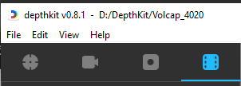

 **DepthKit**
1. Next You will need to launch DepthKit.
2. To use the existing calibration, double-click on the project folder located: "D:\DepthKit" named "Volcap_4020".
	>If you encounter any issues with the camera calibration, please refer to the [Calibration](https://docs.depthkit.tv/docs/calibration) documentation  on recalibrating the cameras. If necessary, please create a new project for this purpose.
3. Place your subject at the center marking of the room. 
	>(Please ensure that the subject avoids wearing black/ white/ glasses/ ripped clothes for the best texture output.)
	> For optimal results, it's important to remain within the marked boundaries of the room throughout the entire recording session.
4. [If you want to record audio, please click here.](reaper.md)
5. When you are confident with your setup, click on the "Start Streaming" button under the Controls section of Depthkit.
6. You have the option to name your take under Recording Prefix.
7. Remember to use a visual and audible cue at the beginning of each take, such as clapping your hands, to help with the syncing process.
      

     
   

8. In DepthKit, hit the Record button, a Diagnostics panel will be displayed.
       

     

9. After finishing your recording session, click on "End Recording" button.
10. Click on the "Stop Streaming" button when you have finished recording. (You can refer to this [link](https://docs.depthkit.tv/docs/studio-recording) for more information)
11. Head to the "Editor" tab.
      

     

12. You can drill into each sensor by clicking the arrow next to the clip's name in the Library.
      

     

13. To create an asset that can be quickly placed into  the  Unity project, you can export a Multiperspective CPP Video. To do this, click on "Multiperspective CPP Video" from the export drop-down menu. Then, go to the location where the files were saved and copy the generated files from Depthkit.
	>(For more information refer to this link : [Exporting](https://docs.depthkit.tv/docs/exporting))
14. Next step: [Go to Git Bash](Gitbash.md)
