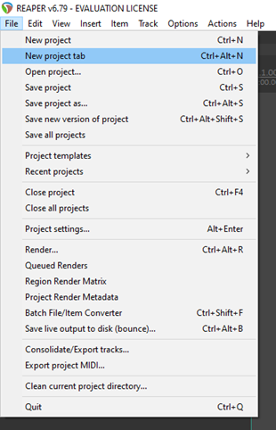
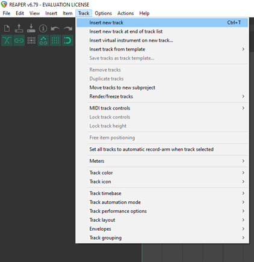
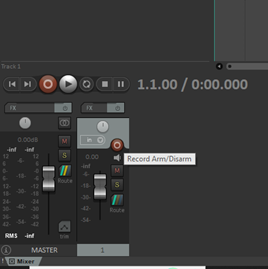
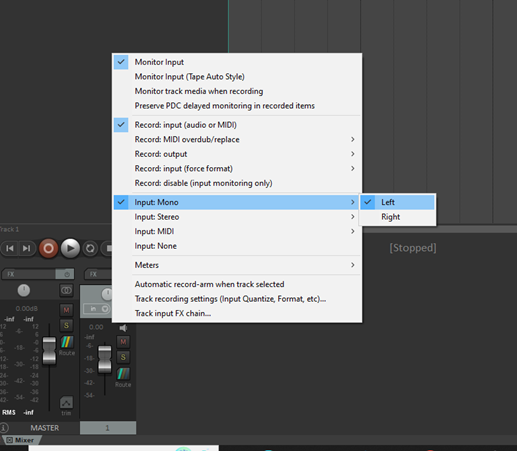
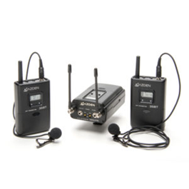
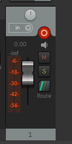
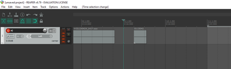
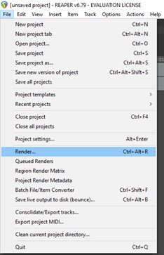

**Reaper**
1. Prepare your microphone setup for basic recording by following these steps:
2. Launch Reaper
3. Ensure that the audio interface is selected as both the input and output device. 
4. Connect the male XLR input to the interface.
5. Create a new project tab.
       

     
   

6. Then create a new track in your Digital Audio Workstation by going to the Track menu option.
       

     
   

7. Set the input for the track to match the input of the microphone. Right click on the Record Arm button of the track.
       

     
   

8. Select the channel input, repeat the previous steps for each microphone being recorded.
       

     
   

9. Turn on the transmitter and receiver for the lav microphone.
       

     
   

10. Check the gain levels before starting the recording, making sure that the track record is armed.
11. Press the ‘record arm/disarm button’ for recording and then press the record button when you are ready to begin.
       

     
   

12. Move the PlayHead further and record for the subsequent takes.
       

     
   

13. For exporting audio files, Go to File > Render. Specify the Bounds, the Time ranges, Output directory and File name and hit Render File.
       

     
   

14. To continue working with Depthkit, [click here](Depthkit.md)
