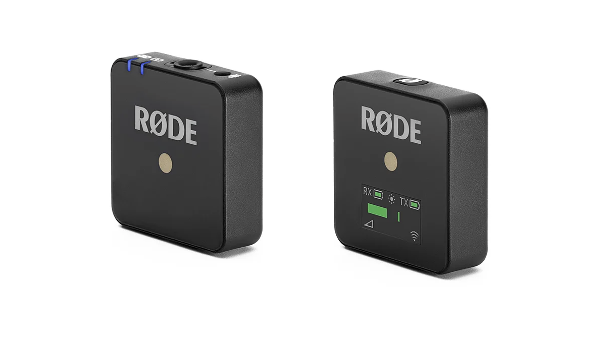
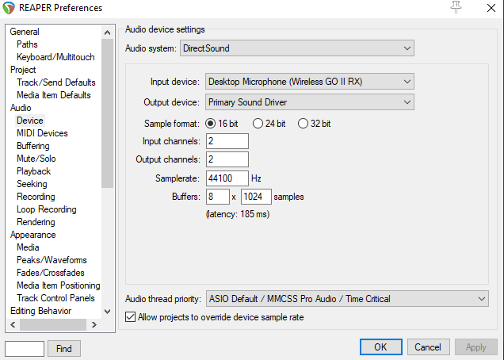
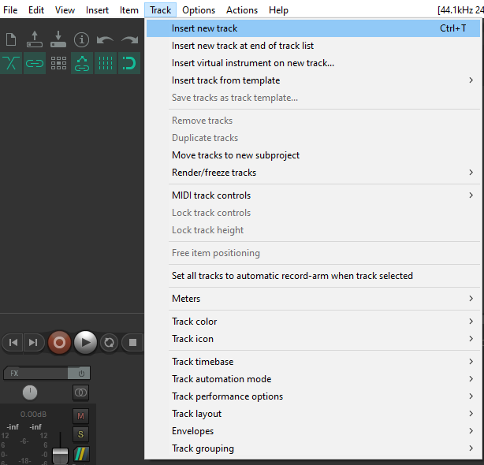
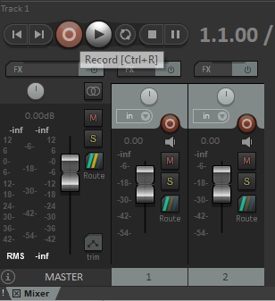
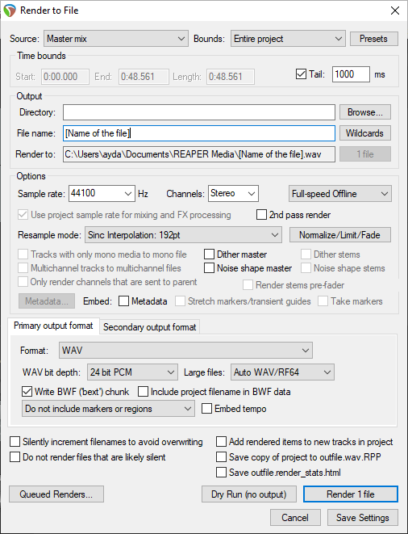

**Reaper**
1. Prepare your microphone setup for basic recording by following these steps:
2. Launch Reaper
3. Create a new project tab.
       

     
   

4. Then create a new track in your Digital Audio Workstation by going to the Track menu option.
       

     
   

5. Set the input for the track to match the input of the microphone. Right click on the Record Arm button of the track.
       

     
   

6. Select the channel input, repeat the previous steps for each microphone being recorded.
       

     
   

7. Use the microphones in the box labeled as VolCap Audio.
       

     
   

8. Check the gain levels before starting the recording, making sure that the track record is armed.
9. Press the ‘record arm/disarm button’ for recording and then press the record button when you are ready to begin.
       

     
   

10. Move the PlayHead further and record for the subsequent takes.
       

     
   

11. For exporting audio files, Go to File > Render. Specify the Bounds, the Time ranges, Output directory and File name and hit Render File.
       

     
   

12. To continue working with Depthkit: [click here](Depthkit.md)

# Recording Audio with Reaper

## Introduction
This guide will help you set up and record high-quality audio using the Rode Wireless GO II system with Reaper.

## Setup the Rode Wireless GO II
1. **Pair the Units**:
   - Utilize the Rode Wireless GO II microphones stored in the box labeled "VolCap Audio."

     

     
2. **Pair the Units**:
   - Turn on both units and pair them.
3. **Connect the receiver to Computer**:
   - Use the USB-A to USB-C cable.

## Configure Audio Settings in Reaper
1. **Open Reaper**:
   - Launch Reaper on the computer.
2. **Set Up Audio Device**:
   - Go to `Options > Preferences`.
   - Select `Audio > Device`.
   - Set the `Audio system` to `DirectSound`
   - Select the Rode Wireless GO II as your `Input device`.

     

     
3. **Create a New Track**:
   - Create a new track in your Digital Audio Workstation by going to the Track menu option.
       

     
   

## Recording Audio with Reaper
1. **Start Recording**:
   - Making sure that the track record is armed.
   - Click the `Record` button to start recording.

     

     
2. **Stop Recording**:
   - Click the `Stop` button to stop recording and save the audio.

## Exporting Audio
1. **Export as WAV or MP3**:
   - Go to `File > Render`.
   - Name the recording.
   - Choose the desired `Output format`.
   - Click `Render 1 file`.

     

     

### Useful Links
- [Reaper User Guide](https://www.reaper.fm/userguide.php)
- [Rode Wireless GO II User Guide](https://rode.com/en/user-guides/wirelessgoii)

