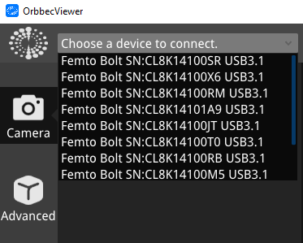
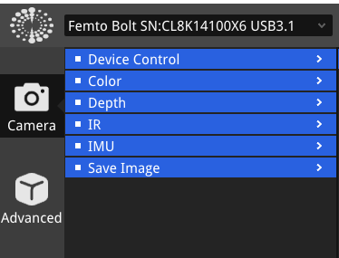
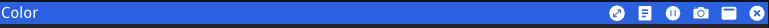

## **Volumetric Capture 4020 Documentation**

**Steps to perform Volumetric Capture in 4020:**
 1. Turn the PC labeled as "Scorpio" in room 4020 on, and login using your PID. (the name in front of your VT email address)
 2. The Software you will need:
    - Orbbec Viewer
    - [DepthKit](Depthkit.md)
    - [Git Bash](Gitbash.md)
    - Unity
    - [Adobe Premiere](adobe.md)
    - [Reaper (Optional)](reaper.md)
  

### Orbbec Viewer Guide

*Connecting and Viewing Device Information:*

1. *Connection Status:* 
   - Open the Orbbec Viewer software after confirming the Orbbec 3D camera is connected.
   
2. *Device Details:*
   - Use the dropdown menu on the left side to access device information.

     

*Camera Control:*
You can access these options either from the tab in the top.

     

Or from the Camera button to the left.

     

1. *Depth Features:*
   - View the colorized depth data representation.

2. *Color Features:*
   - Contol the exposure, brightness, sharpness and other settings of the camera.

3. *IMU (Inertial Measurement Unit):*
   - Correct IMU data and calibrate the gyroscope.

*Save Image:*

- Store depth, RGB, IR data via the screenshot button or the "Image Save" tab.

*Stream Preview Window Controls:*

- Buttons for maximizing/minimizing, showing/hiding metadata, pausing/starting streams, capturing snapshots, adjusting preview size, and stopping streams.

     

 11. Now you are done with Azure Kinect Viewer
 12. Next step: [Go to Depthkit](Depthkit.md)
